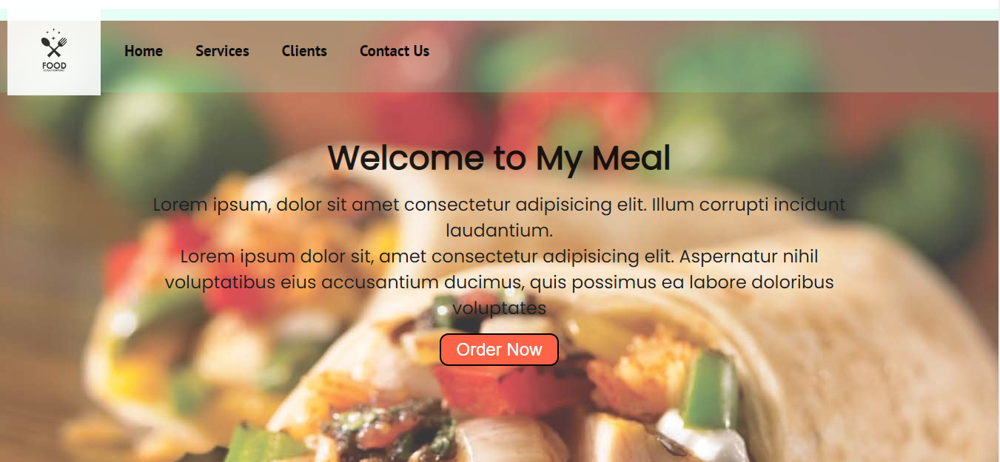
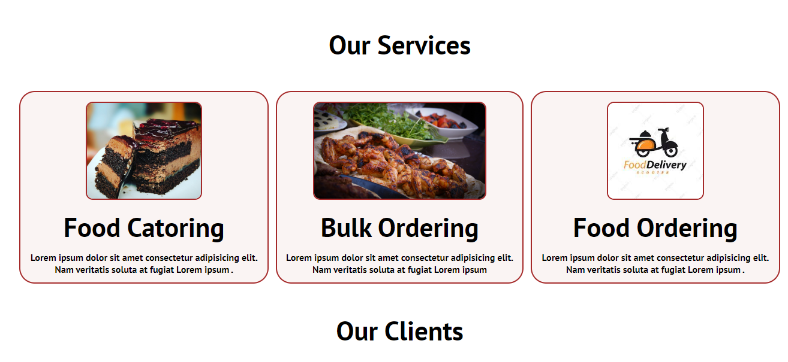
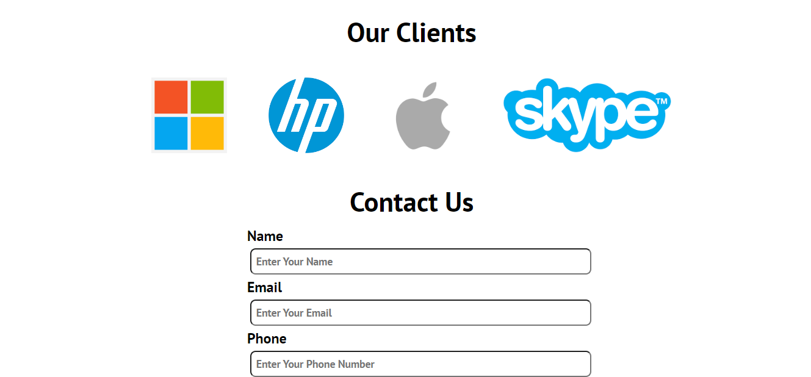
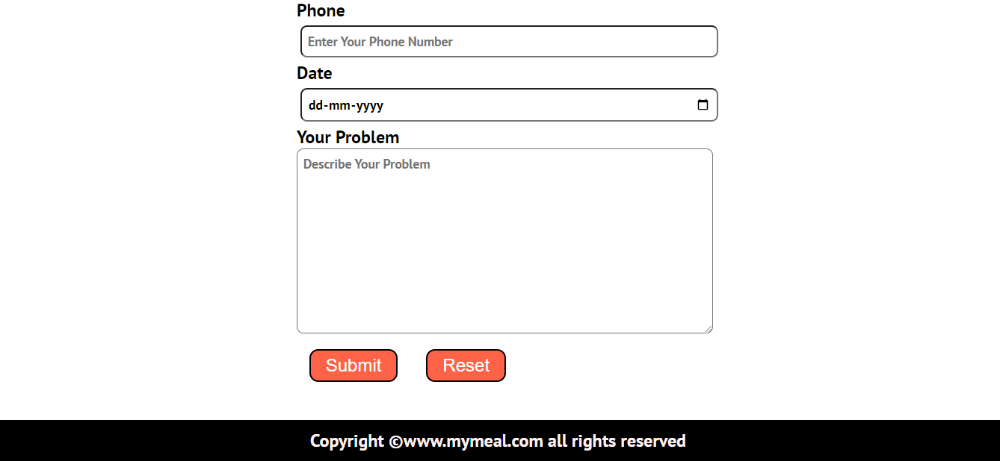

# fooddeliveryfrntend

- visit here: https://rahul87911.github.io/fooddeliveryfrntend/

# Introduction
- Basic template for the front-page of a food-delivery service website.
- Backend is not involved in this project.
- It has a navbar, which smoothly scrolls you to different sections of the page.
- It has a form, which demands the basic details from the user. 

# Languages Used
- `HTML5`, `CSS`

# Preview

  
   
   
   

# Credits
- <a href="https://github.com/rahul87911">RAHUL MISHRA</a> 
- Thanks for visting here.

